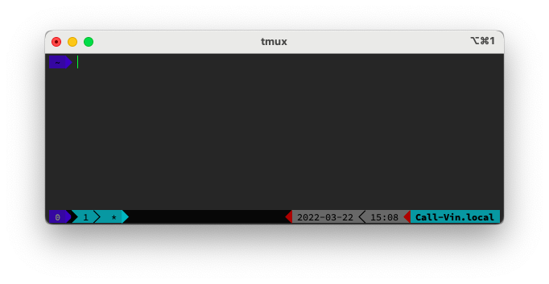
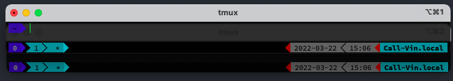

# KAnggara tmux Theme with zsh and oh-my-zsh

<p align="center"><a href="https://kanggara.me" target="_blank"></a></p>

<p align="center">


<br>

<br><br>
<b>My tmux Configuration</b>
</p>
<p align="center">Designed for a fluent and clear workflow based on the <a href="https://www.nordtheme.com" target="_blank">Nord</a> color palette.

</p>

### Disclaimer

This theme is clone from [Nord tmux](https://github.com/arcticicestudio/nord-tmux) all right reserved, Regard to [author](https://github.com/arcticicestudio).

## Table of content

0. [This Table of Content](#table-of-content)
1. [Introduce](#introduce)
2. [Software Requirements](#software-requirements)
3. [Feature](#feature)
4. [Installation](#installation)
   - [Backup](#backup-your-existing-configuration)
   - [Pre-Request Powerline Fonts](#pre-request-powerline-fonts)
   - [Manual](#manual)
   - [Automatic](#automatic)
     <!-- - [Installation](#installation) -->
5. [Contributing](#contributing)

## Introduce

Visit the [official website][ka] to learn all about the [fluidly merging appearance][nord-home#intro] features, details and elements of [UI elements][nord-home#ui-elements], the [various theme configurations][nord-home#configurations] and the [support for plugins][nord-home#plugin-support].

## Software Requirements

- [git](https://git-scm.com/)
- [tmux](http://tmux.github.io/)
- [zsh](https://zsh.org/)
- [brew](https://brew.sh/)
- [Powerline Fonts](https://github.com/powerline/fonts#quick-installation)
- [Exa](https://the.exa.website/)

## Features

<div align="center"><p><strong>Your terminal. Your style.</strong></p><p>The unified UI element design provides a clutter-free and fluidly merging appearance.</p></div>

<p align="center"></p>

<div align="center"><p><strong>Take your favorite plugins with you.</strong></p><p>The theme supports popular plugins for a fluid and unobtrusive user interface transition.</p></div>

<p align="center"></p>

## Installation

<i>Note: Please backup your existing configuration before installing this theme.</i>

### Backup your existing configuration

backup your existing configuration by copy and paste the following command to your terminal

```bash
    cd ~ && mv .tmux.conf .tmux.conf.bak && mv .tmux.conf.local .tmux.conf.local.bak
```

### Pre-Request Powerline Fonts

install Powerline Fonts by copy and paste the following command to your terminal

```bash
  git clone https://github.com/powerline/fonts.git --depth=1
  cd fonts
  ./install.sh
  cd ..
  rm -rf fonts
```

### Manual

#### To install KAnggara tmux manually using Git

1. clone the repository into ~/.tmux/themes/ka-tmux

   using https

```bash
  git clone https://github.com/kanggara75/ka-tmux.git ~/.tmux/themes/ka-tmux
```

2. source the downloaded theme by adding the path of the kanggara.tmux file to the bottom of your .tmux.conf, located in your home directory:

```bash
  run-shell "~/.tmux/themes/ka-tmux/kanggara.tmux"
```

3. reload your .tmux.conf file to source- and activate the theme:

```bash
  tmux source-file ~/.tmux.conf
```

### Automatic

By default, the latest version will be installed. To use the latest development state from the main branch instead, go to the installation path of tmux and switch to the main branch or any other version tag you like.

copy and paste the following command to your terminal

```bash
/bin/bash -c "$(curl -fsSL https://raw.githubusercontent.com/kanggara75/ka-tmux/main/install.sh)"
```

example of instalation process:

<p align="center"></p>

## Contributing

This theme is an open source project and we love to receive contributions from the [community][ka]!

<p align="center">Copyright &copy; 2022-present <a href="https://www.kanggara.me" target="_blank">KAnggara</a></p>

<p align="center"><a href="https://github.com/kanggara75/ka-tmux/blob/develop/LICENSE.md"></a></p>

[ka]: https://kanggara.me
[nord-home#intro]: https://www.nordtheme.com/ports/tmux#intro
[nord-home#ui-elements]: https://www.nordtheme.com/ports/tmux#ui-elements
[nord-home#configurations]: https://www.nordtheme.com/ports/tmux#configurations
[nord-home#plugin-support]: https://www.nordtheme.com/ports/tmux#plugin-support
